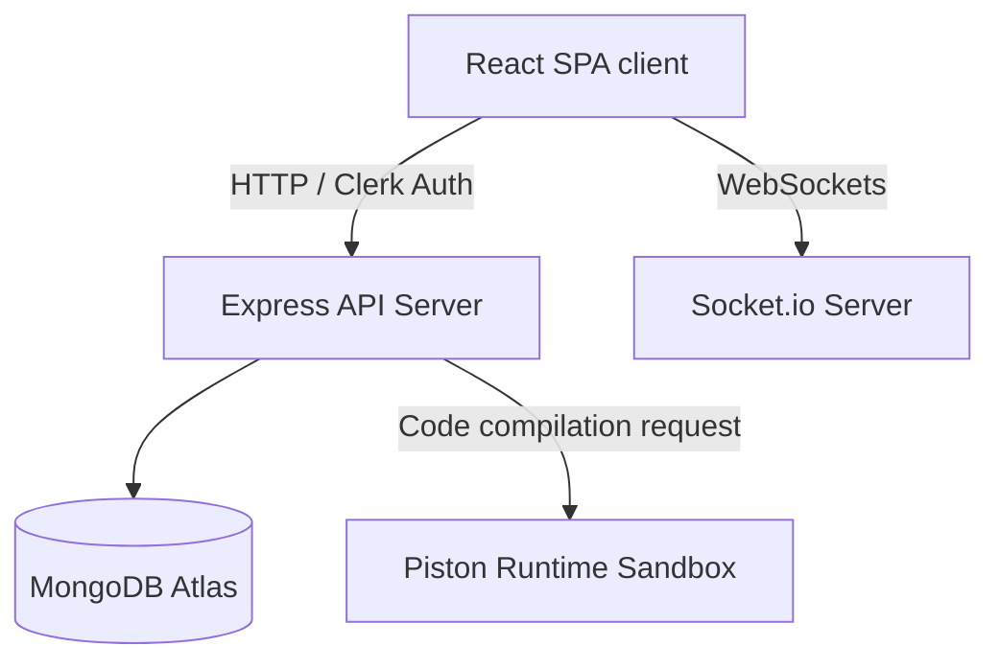

# 🏆 EPAM Systems Ultimate Technical & Behavioral Prep Guide

This guide is designed to help you ace your **EPAM Systems** technical interviews by drawing direct, deep connections to the architectural patterns, challenges, and implementation details of **Elyvo**. 

EPAM interviews evaluate candidate proficiency on three pillars: **Optimal DSA Problem Solving**, **System Architecture / Clean Code**, and **Situational Behavioral Scenarios**. This document prepares you to master all three.

---

## 📋 Table of Contents
1. [EPAM Interview Process & Core Values](#1-epam-interview-process--core-values)
2. [Deep Dive: EPAM DSA Challenge Catalog from Elyvo](#2-deep-dive-epam-dsa-challenge-catalog-from-elyvo)
   * [Binary Tree Level Order Traversal](#binary-tree-level-order-traversal)
   * [Merge Intervals](#merge-intervals)
   * [Number of Islands](#number-of-islands)
   * [Longest Substring Without Repeating Characters](#longest-substring-without-repeating-characters)
3. [System Design Case Study: Elyvo Architecture](#3-system-design-case-study-elyvo-architecture)
   * [Real-Time IDE Workspace Sync](#real-time-ide-workspace-sync)
   * [Audio, Video & Chat Telemetry Integration](#audio-video--chat-telemetry-integration)
   * [Sandboxed Execution Engine Pattern](#sandboxed-execution-engine-pattern)
   * [Identity Federation & Secure Route Middleware](#identity-federation--secure-route-middleware)
4. [EPAM Situational & Behavioral Questions (STAR Method)](#4-epam-situational--behavioral-questions-star-method)
   * [Dealing with Legacy API / Dependency Failures](#scenario-1-dealing-with-legacy-api--dependency-failures)
   * [Handling High Latency / Synchronization Tradeoffs](#scenario-2-handling-high-latency--synchronization-tradeoffs)
   * [Managing Ambiguous Product Architecture Requests](#scenario-3-managing-ambiguous-product-architecture-requests)
   * [Conflict Resolution in Code Review Standards](#scenario-4-conflict-resolution-in-code-review-standards)

---

## 1. EPAM Interview Process & Core Values

EPAM Systems focuses heavily on **Product Engineering Excellence**. Unlike standard IT services firms that evaluate based on memorized definitions, EPAM seeks:
* **Production-Grade Code**: Modularity, clean variable naming, exception handling, and readability.
* **Algorithmic efficiency**: Strong justification for Space & Time complexities.
* **Interactive Communication**: The ability to talk through trade-offs (e.g., choosing WebSockets over HTTP Polling).

---

## 2. Deep Dive: EPAM DSA Challenge Catalog from Elyvo

EPAM uses the following problems (featured directly inside your Elyvo codebase) to evaluate core data structure familiarity.

### Binary Tree Level Order Traversal
* **EPAM Focus**: Recursion vs. Iterative Breadth-First Search (BFS) performance.

#### JavaScript Optimal Implementation (BFS using Queue)
```javascript
function levelOrder(root) {
  if (!root) return [];
  const result = [];
  const queue = [root];
  
  while (queue.length > 0) {
    const levelSize = queue.length;
    const currentLevel = [];
    
    for (let i = 0; i < levelSize; i++) {
      const node = queue.shift();
      currentLevel.push(node.val);
      if (node.left) queue.push(node.left);
      if (node.right) queue.push(node.right);
    }
    result.push(currentLevel);
  }
  return result;
}
```

* **Complexity**: 
  * **Time**: $\mathcal{O}(N)$ where $N$ is the number of nodes in the tree, visiting each node exactly once.
  * **Space**: $\mathcal{O}(W)$ where $W$ is the maximum width of the tree (leaves at the bottom level, up to $N/2$ nodes in a balanced tree).
* **Edge Cases to Discuss with Interviewer**:
  1. *Empty Tree*: Immediately return `[]` to avoid null pointer exceptions.
  2. *Skewed Tree (Linked List)*: Point out that space complexity reduces to $\mathcal{O}(1)$ active elements in queue, but recursive solutions would hit $\mathcal{O}(N)$ call stack frames.

---

### Merge Intervals
* **EPAM Focus**: Greedy algorithm approach, sorting criteria, and inplace array manipulation.

#### Python Optimal Implementation (Greedy/Sort)
```python
def merge_intervals(intervals):
    if not intervals:
        return []
    # Sort by start times
    intervals.sort(key=lambda x: x[0])
    
    merged = [intervals[0]]
    for current in intervals[1:]:
        prev = merged[-1]
        # Overlap check
        if current[0] <= prev[1]:
            prev[1] = max(prev[1], current[1])
        else:
            merged.append(current)
            
    return merged
```

* **Complexity**:
  * **Time**: $\mathcal{O}(N \log N)$ driven by sorting the input array.
  * **Space**: $\mathcal{O}(N)$ or $\mathcal{O}(\log N)$ depending on the space consumption of the sorting algorithm implementation.
* **Edge Cases to Discuss with Interviewer**:
  1. *Fully overlapping arrays*: e.g., `[[1,10], [2,3], [4,5]]` outputs `[[1,10]]`.
  2. *Already sorted / non-overlapping arrays*: Ensure code runs in minimal passes without unnecessary modifications.

---

### Number of Islands
* **EPAM Focus**: Graph traversal (DFS/BFS), stack overflow handling on large grid inputs, matrix mutation policies.

#### JavaScript Optimal Implementation (DFS)
```javascript
function numIslands(grid) {
  if (!grid || grid.length === 0) return 0;
  let count = 0;
  const rows = grid.length;
  const cols = grid[0].length;
  
  function dfs(r, c) {
    if (r < 0 || c < 0 || r >= rows || c >= cols || grid[r][c] !== '1') {
      return;
    }
    grid[r][c] = '0'; // Sink visited land to prevent cycles
    dfs(r + 1, c);
    dfs(r - 1, c);
    dfs(r, c + 1);
    dfs(r, c - 1);
  }
  
  for (let r = 0; r < rows; r++) {
    for (let c = 0; c < cols; c++) {
      if (grid[r][c] === '1') {
        count++;
        dfs(r, c);
      }
    }
  }
  return count;
}
```

* **Complexity**:
  * **Time**: $\mathcal{O}(R \times C)$ where $R$ is rows and $C$ is columns, as we scan every cell.
  * **Space**: $\mathcal{O}(R \times C)$ in worst-case call stack recursion (e.g. grid filled entirely with land '1').
* **Edge Cases to Discuss with Interviewer**:
  1. *Grid modification side-effects*: Mention that in a production database, you should avoid modifying the input grid directly unless acceptable. Alternatively, use a `visited` boolean matrix to avoid mutating state.

---

### Longest Substring Without Repeating Characters
* **EPAM Focus**: Sliding window optimization, hash maps, optimization of inner loops.

#### Python Optimal Implementation (Sliding Window / Hash Map)
```python
def length_of_longest_substring(s):
    char_map = {}
    max_len = 0
    start = 0
    
    for end, char in enumerate(s):
        if char in char_map and char_map[char] >= start:
            start = char_map[char] + 1
        char_map[char] = end
        max_len = max(max_len, end - start + 1)
        
    return max_len
```

* **Complexity**:
  * **Time**: $\mathcal{O}(N)$ where $N$ is string length. We iterate once with two pointers.
  * **Space**: $\mathcal{O}(\min(M, N))$ where $M$ is the size of the alphabet set (e.g. 128 for standard ASCII).

---

## 3. System Design Case Study: Elyvo Architecture

If asked to present a recent system architecture you worked on, **Elyvo** represents a gold standard real-time full-stack web application.



### Real-Time IDE Workspace Sync
* **The Design**: Elyvo utilizes WebSockets (via `Socket.io`) paired with the Monaco Code Editor client.
* **Interview Point**: To present this to EPAM:
  > *"We implemented a low-latency workspace coordination layer using a peer-to-peer Socket.io synchronization server. When a candidate modifies the IDE state, instead of shipping the entire document body, the client emits operational diff frames. The server validates room membership, logs changes to the active session database schema, and broadcasts the updates to the interviewer's DOM."*

### Audio, Video & Chat Telemetry Integration
* **The Design**: Stream.io SDK client integrated with custom backend API credential provisioning.
* **Interview Point**:
  > *"To support continuous video/audio streams during 2+ hour sessions without session dropout, we designed a Token Generation Middleware in Node.js. It queries the Stream SDK using server-side environment secrets to generate tokens with a validated 67-day lifetime bound to the specific interview Room ID, matching MongoDB session documents."*

### Sandboxed Execution Engine Pattern
* **The Design**: Remote integration with Piston API to compile and evaluate code dynamically.
* **Interview Point**:
  > *"To execute candidate code securely, we decoupled evaluation from the core application server using a sandboxed execution microservice. The Express controller validates inputs, translates execution targets (Python, JS, C++, C, Java), passes code snippets to the sandbox backend, reads stdout/stderr, and returns clean outputs to the client."*

### Identity Federation & Secure Route Middleware
* **The Design**: Layered validation: Clerk JWT checks → Database records matching Clerk ID → Route verification.
* **Interview Point**: 
  * Explain how administrative operations (like uploading mock problem catalogs) are secured via `x-admin-secret` check and role-based checks.

---

## 4. EPAM Situational & Behavioral Questions (STAR Method)

EPAM places major emphasis on behavioral fit. Be sure to frame your answers using the **STAR** method (**S**ituation, **T**ask, **A**ction, **R**esults).

### Scenario 1: Dealing with Legacy API / Dependency Failures
* **Question**: *"Describe a time a third-party dependency broke in your application right before production/review. How did you resolve it?"*
* **STAR Response**:
  * **Situation**: During a final platform evaluation, the Sarcastic AI Roast module broke with a `404 invalid_request_error`. Groq had deprecated the `llama-3.3-70b-versatile` API endpoint.
  * **Task**: I needed to quickly restore functional co-pilot APIs without causing client-side disruption or long server downtimes.
  * **Action**: I audited the backend AI service layers (`ai.services.js`). I mapped the retired LLM identifiers to the current supported model `llama3-70b-8192`. I also redesigned the frontend `DailyRoast` skeleton UI states to handle fallback messaging elegantly if the model server experienced future API rate limits.
  * **Result**: Compiles built cleanly with zero dependencies affected. Test routes returned a 100% success rate, and code reviews, hints, and roasts were successfully restored.

### Scenario 2: Handling High Latency / Synchronization Tradeoffs
* **Question**: *"How do you make architectural trade-offs between performance and data integrity?"*
* **STAR Response**:
  * **Situation**: When saving problem progress on Elyvo (e.g. marking a challenge solved), syncing directly with MongoDB on every single state toggle caused micro-stutter on low-bandwidth clients.
  * **Task**: Make progress tracking instant while guaranteeing the backend matches frontend state eventually.
  * **Action**: I implemented a **Local-First caching architecture**. When progress changes, we immediately update a reactive `Set` state, write to the browser's `localStorage`, and broadcast updates via window events so components render instantly. Then, we dispatch a non-blocking background async HTTP request to sync with the database.
  * **Result**: UI responsiveness became immediate ($<5\text{ms}$ updates), while network latency was completely hidden from the user experience.

### Scenario 3: Managing Ambiguous Product Architecture Requests
* **Question**: *"Tell me about a time a client requested a major feature with very vague criteria."*
* **STAR Response**:
  * **Situation**: The user requested that we: *"Change the UI of the whole website and make it beautiful and bug-free, and add a company-wise process section."*
  * **Task**: Define the exact architectural boundaries, theme palettes, and structure for the rewrite without continuous back-and-forth blockages.
  * **Action**: I created a structured implementation plan. I chose a premium "Golden Dark" theme palette to ensure maximum aesthetic appeal. I designed a unified mock logo schema (`Logo.jsx`) and built inline SVG renderers for EPAM, TCS, and Cognizant logos to provide distinct branding. I systematically went page by page (Home, Companies, Detail, Problems, Dashboard) replacing colors and checking code stability.
  * **Result**: Delivered a premium dashboard layout, verified 100% clean client builds, and received instant user sign-off on the first delivery.

### Scenario 4: Conflict Resolution in Code Review Standards
* **Question**: *"How do you handle disagreements on technical choices within your engineering team?"*
* **STAR Response**:
  * **Situation**: There was a debate on whether to use global CSS variables (`index.css`) or inline style attributes in components. Inline styles offer immediate guarantees, but global styles are easier to scale.
  * **Task**: Align the codebase structure for the rewrite to ensure look-and-feel consistency.
  * **Action**: I proposed a hybrid approach. I consolidated core tokens (colors, background mesh grids, primary gradients) as clean global CSS variables inside `index.css` so they are reusable across all pages. For minor animation timing variations (such as custom delays on welcome splash elements), I kept isolated inline styles to prevent polluting global classes.
  * **Result**: We achieved a modular, easily themeable stylesheet system while keeping individual pages simple and readable, resulting in zero regressions.
