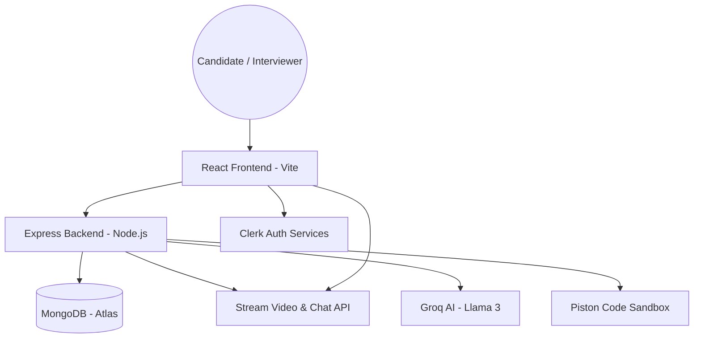
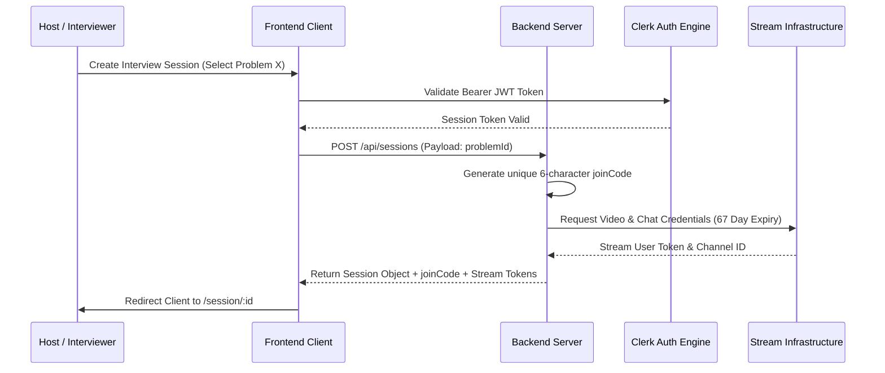
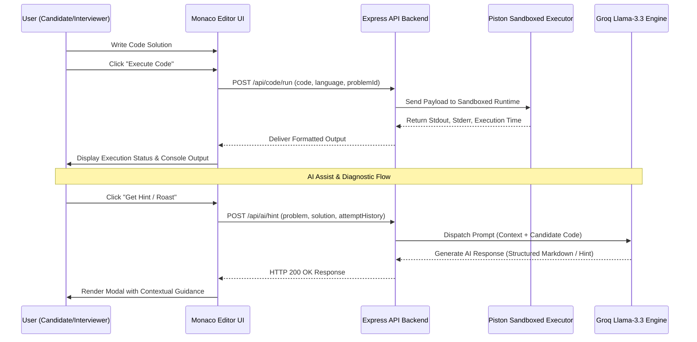
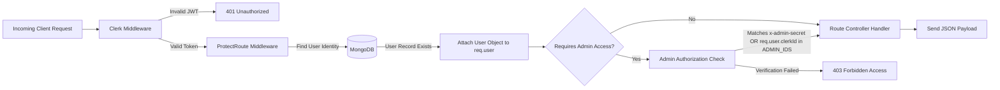

# 🚀 Elyvo Complete Interview & Technical Guide

Welcome to the comprehensive **Elyvo Interview & Technical Guide**. This document synthesizes full system design specifications, administrative operation guidelines, core application workflows, database schemas, and technical interview platform architecture for Elyvo V2.0.

---

## 📋 Table of Contents
1. [Overview & Core Value Proposition](#-overview--core-value-proposition)
2. [Tech Stack & System Architecture](#-tech-stack--system-architecture)
3. [Interview Session & Handshake Protocol](#-interview-session--handshake-protocol)
4. [AI Diagnostics & Co-pilot Engine](#-ai-diagnostics--co-pilot-engine)
5. [Backend Middleware & Authentication Pipeline](#-backend-middleware--authentication-pipeline)
6. [Administration & Content Management Guide](#-administration--content-management-guide)
7. [Database Schema & Problem Catalog Specification](#-database-schema--problem-catalog-specification)
8. [Setup, Execution & Environment Configuration](#-setup-execution--environment-configuration)

---

## 🚀 Overview & Core Value Proposition

**Elyvo** is a state-of-the-art, real-time collaborative technical interview platform built for high-performance engineering teams. Designed with an **"Obsidian" aesthetic**, high-throughput multi-user execution sandboxes, and intelligent AI diagnostics, Elyvo elevates technical candidate evaluation to industry enterprise standards.

### ✨ Key Capabilities
* **Synchronized Real-Time IDE**: Zero-latency collaborative editor powered by Monaco Editor, supporting multi-language syntax highlighting, auto-completion, and state management (JavaScript, Python, C++, Java, C).
* **High-Definition Video & Peer-to-Peer Audio/Chat**: Built on Stream.io SDKs with token lifetime persistence for uninterrupted long-form interview sessions.
* **AI Interview Co-pilot & Roast Engine**: Powered by Groq (Llama-3.3-70B) & Gemini Flash for real-time hint generation, sarcastic/engaging coding feedback, and structural logic verification.
* **Candidate Analytics & Heatmaps**: Interactive dashboard rendering candidate history, execution accuracy, activity heatmaps, and past interview metrics.
* **Hardened Administrative API**: Multi-admin identity governance using Clerk IDs combined with global admin secrets for bulk challenge provisioning.

---

## 🏗️ Tech Stack & System Architecture

### Technical Breakdown
* **Frontend**: React (Vite), Tailwind CSS, Lucide Icons, Monaco Code Editor, Stream Video React SDK.
* **Backend**: Node.js, Express.js, Mongoose (MongoDB Atlas).
* **Authentication**: Clerk Multi-Session & Identity Management.
* **Audio/Video & Real-Time Chat**: Stream.io SDK.
* **AI Diagnostics**: Groq SDK (Llama 3.3 70B Versatile) & Google Gemini Flash.
* **Code Execution Sandbox**: Piston Remote Execution Engine.

### 1. High-Level Architecture Diagram



---

## 🤝 Interview Session & Handshake Protocol

During an interview session, security and low latency are paramount. The handshake mechanism manages JWT validation via Clerk and provisions long-lived Stream.io tokens (configured for **67-day operational validity** per interview room).

### 2. Session Lifecycle Sequence Diagram



---

## 💡 AI Diagnostics & Co-pilot Engine

The platform incorporates real-time AI capabilities allowing candidates or interviewers to request hints, code execution feedback, or logic reviews.

### 3. Code Execution & AI Hint Sequence Diagram



---

## 🛡️ Backend Middleware & Authentication Pipeline

All incoming administrative and user requests pass through strict layered middleware ensuring resource isolation and route protection.

### 4. Middleware Flowchart



---

## 🔐 Administration & Content Management Guide

Administrative access allows engineers and recruiters to manage coding challenges, adjust test cases, and control candidate permissions.

### Authentication Modes
1. **Global Admin Secret (API & Postman)**:
   * **Header Name**: `x-admin-secret`
   * **Value Configuration**: Set in `backend/.env` under `ADMIN_SECRET` (Default: `elyvo_admin_secret_2026`).
2. **User-Based Admin Clerk IDs (Web UI)**:
   * **Value Configuration**: Set comma-separated Clerk IDs in `backend/.env` under `ADMIN_IDS`.
   * **Example**: `ADMIN_IDS=user_2qDxxx,user_3xYyyy`

### Admin Problem REST API Reference
**Base Path**: `http://localhost:5001/api/admin/problems`

#### 1. Create Problem (`POST /`)
* **Headers**: `x-admin-secret: <ADMIN_SECRET>`
* **Request Payload**:
```json
{
  "id": "two-sum",
  "title": "Two Sum",
  "difficulty": "Easy",
  "category": "Array",
  "description": "Given an array of integers `nums` and an integer `target`, return indices of the two numbers such that they add up to `target`.",
  "constraints": ["2 <= nums.length <= 10^4", "-10^9 <= nums[i] <= 10^9"],
  "starterCode": {
    "javascript": "function twoSum(nums, target) {\n  // Write solution here\n}",
    "python": "class Solution:\n    def twoSum(self, nums: List[int], target: int) -> List[int]:\n        pass"
  },
  "testCases": [
    { "input": [4, [2, 7, 11, 15], 9], "output": "0 1" }
  ]
}
```

#### 2. Update Problem (`PUT /:id`)
* **Headers**: `x-admin-secret: <ADMIN_SECRET>`
* **URL**: `http://localhost:5001/api/admin/problems/two-sum`
* **Request Payload**: Include fields requiring mutation.

#### 3. Delete Problem (`DELETE /:id`)
* **Headers**: `x-admin-secret: <ADMIN_SECRET>`
* **URL**: `http://localhost:5001/api/admin/problems/two-sum`

---

## 📝 Database Schema & Problem Catalog Specification

### Data Dictionary

| Field | Schema Type | Constraints | Description |
| :--- | :--- | :--- | :--- |
| `id` | String | Unique, Index | Unique slug identifier (e.g., `palindrome-number`) |
| `title` | String | Required | Display name of the problem |
| `difficulty` | String | Enum (`Easy`, `Medium`, `Hard`) | Difficulty tier |
| `category` | String | Required | Domain tag (e.g., `Array`, `Trees`, `Dynamic Programming`) |
| `description` | String | Markdown | Detailed problem description & example explanations |
| `starterCode` | Map/Object | Keys: `javascript`, `python`, `cpp`, `java`, `c` | Starter boilerplate code provided to candidates |
| `testCases` | Array | Objects containing `input`, `output` | Automated verification cases for Piston sandbox |

---

## 📦 Setup, Execution & Environment Configuration

### 1. Repository Setup
```bash
git clone https://github.com/AbhinavSinghBhadouria/Elyvo.git
cd Elyvo
```

### 2. Environment Variables Configuration (`backend/.env`)
```env
PORT=5001
DB_URL=mongodb+srv://<username>:<password>@cluster.mongodb.net/elyvo
CLERK_SECRET_KEY=sk_test_...
STREAM_API_KEY=your_stream_api_key
STREAM_API_SECRET=your_stream_api_secret
GROQ_API_KEY=gsk_...
ADMIN_SECRET=elyvo_admin_secret_2026
ADMIN_IDS=user_clerk_id_1,user_clerk_id_2
```

### 3. Dependency Installation & Launch
```bash
# Backend Installation
cd backend && npm install

# Frontend Installation
cd ../frontend/vite-project && npm install

# Run Complete Application
cd ../..
npm run dev
```

---

<p align="center">
  <strong>Elyvo Interview Guide V2.0</strong> • Formatted for full system transparency & developer readiness.
</p>
