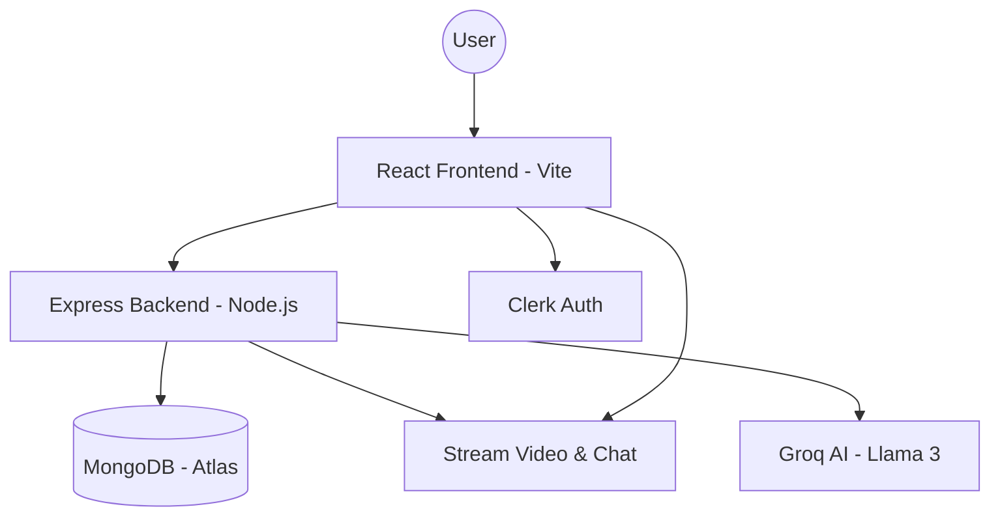
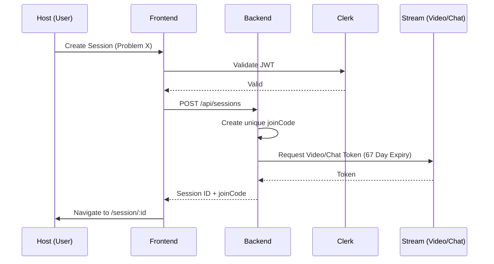
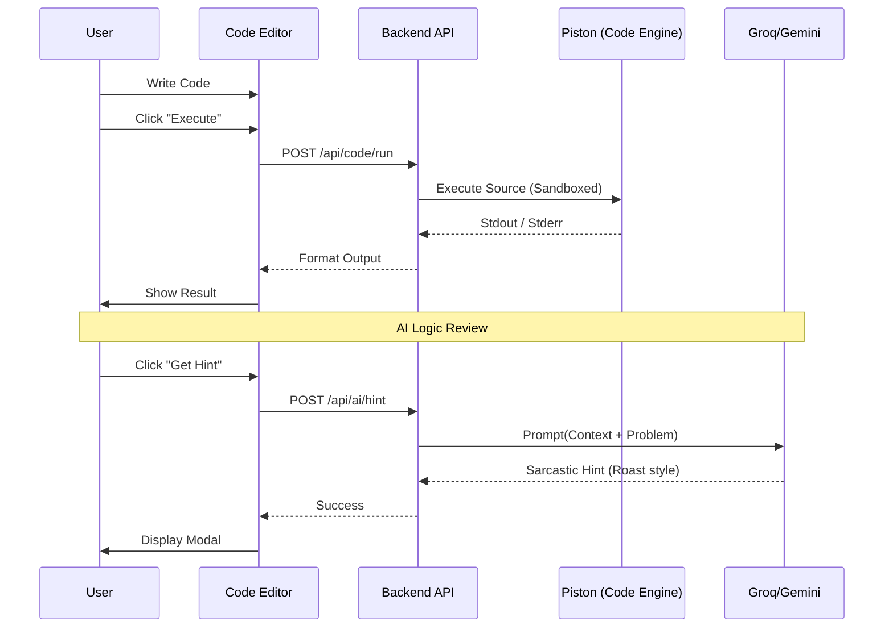
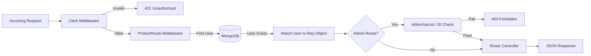

<p align="center">
  
</p>

<h1 align="center">Elyvo V2.0</h1>

<p align="center">
  <strong>The Professional Collaborative Technical Interview Platform</strong>
</p>

<p align="center">
  
  
  
</p>

---

## 🚀 Overview

**Elyvo** is a premium, real-time collaborative technical interview platform designed for modern engineering teams. Version 2.0 introduces a state-of-the-art "Obsidian" aesthetic, integrated AI diagnostics, and a hardened multi-user admin architecture.

### ✨ Key Features
- **Real-time IDE**: Zero-lag synchronized code editor with support for 5+ languages.
- **HD Video & Chat**: Seamless peer-to-peer communication powered by Stream.io.
- **AI Co-pilot**: Intelligent hints and code logic reviews powered by Groq (Llama-3.3-70B).
- **Pro Dashboard**: Activity heatmaps, AI coding "roasts", and interview history.
- **Admin Mastery**: Dedicated API for secure problem management and multi-admin support.

---

## 🏗️ System Architecture & Logic

### 1. High-Level System Design
Visualizing the interaction between the Frontend, Backend, and third-party integrations (Clerk, Stream, Groq).



---

### 2. Interview Session & Handshake Flow
How hosts create sessions and how tokens are securely generated with a **67-day expiry**.



---

### 3. AI-Powered Problem Solving Flow
How code execution and AI hints are processed in real-time.



---

### 4. Backend Middleware Pipeline
The internal request lifecycle for secure API endpoints.



---

## 🛠️ Tech Stack

- **Frontend**: React (Vite), Tailwind CSS, Lucide-React, Monaco Editor.
- **Backend**: Node.js, Express, Mongoose.
- **Authentication**: Clerk (Multi-session support).
- **Communication**: Stream.io Video & Chat SDKs.
- **AI Engine**: Groq (Llama 3.3) & Gemini Flash.
- **Infrastructure**: Inngest (Background Jobs), Piston (Remote Execution).

---

## 🔐 Administration

Elyvo 2.0 features a professional admin layer. Admins can manage the global problem set via Postman or the internal dashboard.

Refer to the **[ADMIN_GUIDE.md](./ADMIN_GUIDE.md)** for detailed API documentation.

---

## 📦 Installation & Setup

### 1. Clone the repository
```bash
git clone https://github.com/AbhinavSinghBhadouria/Elyvo.git
cd Elyvo
```

### 2. Configure Environment Variables
Create a `.env` file in the `backend/` directory:
```env
PORT=5001
DB_URL=your_mongodb_url
CLERK_SECRET_KEY=your_clerk_key
STREAM_API_KEY=your_stream_key
STREAM_API_SECRET=your_stream_secret
GROQ_API_KEY=your_groq_key
ADMIN_SECRET=your_admin_secret
```

### 3. Install Dependencies
```bash
# Backend
cd backend && npm install

# Frontend
cd ../frontend/vite-project && npm install
```

### 4. Run Development Server
```bash
# From root
npm run dev
```

---

<p align="center">
</p>
